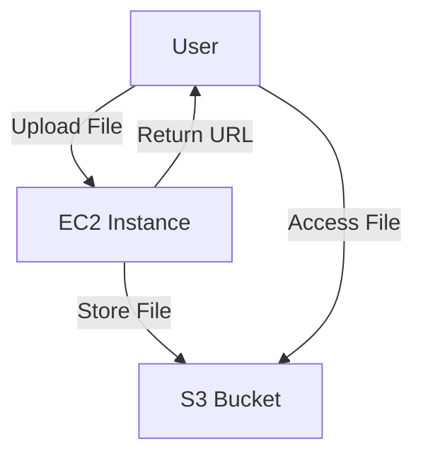

# File Upload Service với AWS S3

Dự án này triển khai một dịch vụ upload file đơn giản sử dụng Golang, AWS EC2 và S3.

## Kiến trúc hệ thống



## Các thành phần chính

1. **EC2 Instance**: Chạy ứng dụng Golang web server
2. **S3 Bucket**: Lưu trữ các file được upload
3. **VPC & Security Groups**: Cấu hình mạng và bảo mật
4. **IAM Role**: Phân quyền cho EC2 truy cập S3

## Yêu cầu

- Terraform >= 1.0.0
- AWS CLI đã được cấu hình
- SSH key pair (đặt tại `~/.ssh/go-web-key.pub`)

## Cài đặt

1. Clone repository:
```bash
git clone <repository-url>
cd <repository-directory>
```

2. Khởi tạo Terraform:
```bash
terraform init
```

3. Xem trước các thay đổi:
```bash
terraform plan
```

4. Triển khai infrastructure:
```bash
terraform apply
```

5. Sau khi triển khai xong, Terraform sẽ hiển thị URL của ứng dụng. Truy cập URL này để sử dụng dịch vụ upload file.

## Sử dụng

1. Truy cập URL ứng dụng (được hiển thị sau khi triển khai)
2. Chọn file cần upload
3. Nhấn nút "Upload"
4. Sau khi upload thành công, bạn sẽ nhận được link để truy cập file trong S3

## Xóa bỏ

Để xóa toàn bộ infrastructure:
```bash
terraform destroy
```

## Bảo mật

- EC2 instance chỉ mở port 22 (SSH) và 8080 (Web)
- S3 bucket được cấu hình để cho phép public read
- IAM role được giới hạn quyền truy cập S3

## Giới hạn

- Kích thước file upload tối đa: 10MB
- Chưa có tính năng xác thực người dùng
- Chưa có tính năng quản lý file (xóa, đổi tên, etc.) 